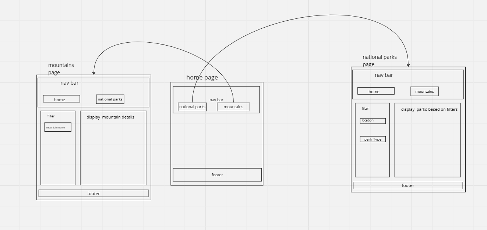
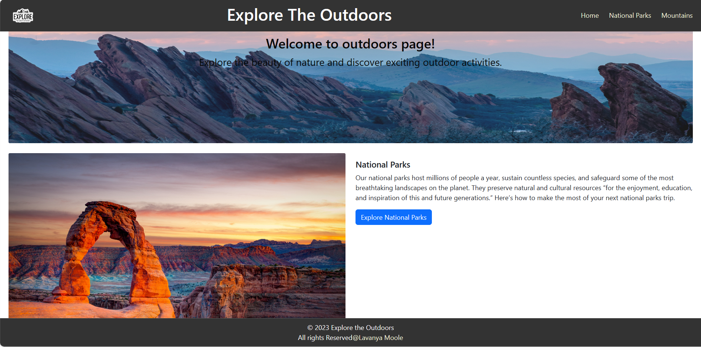
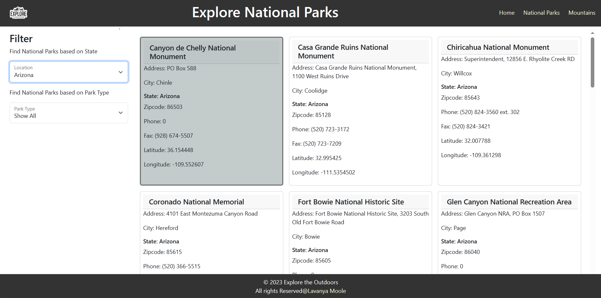
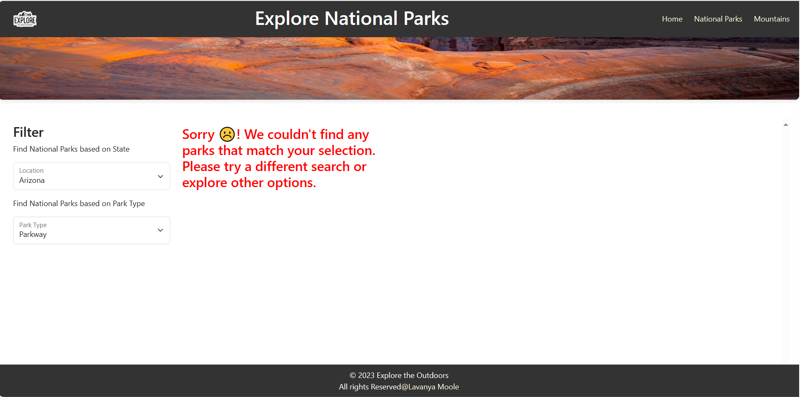
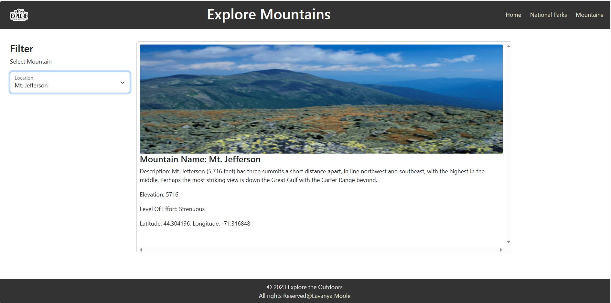

# Explore The Outdoors 🌄
## Description
In this website one can explore the National Parks, Mountins in the USA.
* If the new users don't know much about the website, they can get an idea from the home page.
* User can explore the National parks and filter the parks according to the Location/state/territory and type of park from National Park Search page and get the details of park.
* User can visit the official National Parks by clicking on the links for more information.
* User can explore the Mountains in the USA and get the details of the selected mountain from mountains page.
* User can view the sunrise and sunset timings of a selected mountain. Sunrise and sunset timings are fetched using an API. 

#### Basic Implementation design Plan before starting to create my website

#### some of the page designs of my website are:

## Home page

## National Parks Search Page
* If Parks available for the user selected options

#### Exceptional Case
* If there is no parks available for the user selection

## Mountains Page

### Tools used:
* Bootstrap, VsCode IDE, Git, GitHub

### Technologies used:
* Html, CSS, Bootstrap framework, JavaScript